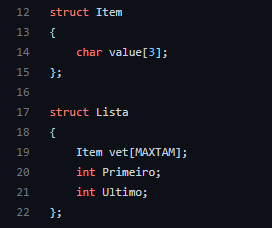

# Exercicio03

O problema da máxima cadeia. Elabore um programa que receba uma cadeias de DNA. Cada posição da cadeia deve conter um códon, ou seja, uma triade de nucleotídeos → T, A, G, C. Feito isso, leia de um arquivo uma sequência de nucleotídios (i.e., ACGTGGCTCTCTAACGTACGTACGTACGGGGTTATATTCGAT) e tente identificar a maior cadeia da lista que se relaciona a essa entrada.

# Solução

Para o programa ser utilizado será preciso de duas cadeias de DNA que serão armazendas em uma lista, em que cada posição da lista é guardado um códon, estas cadeias o usuário as passa por um arquivo para cada cadeia, em que os arquivos não podem estar vazios, o número de letras tem que ser múltiplo de 3 e a cadeia a ser procurada a maior sequência igual tem que ser maior que a outra.

A estrutura da lista que salva a cadeia de DNA é a seguinte, cada item da lista guarda <strong>char[3]</strong> que represnta um cóndon:

Para se achar a maior sequência de S2 em S1 o método a seguir segua a seguinte lógica:
<ol>
  <li>Precisa-se de duas lista extras mseq e aux, uma auxilir e uma que guarda a maior sequência, e uma varíavel pos que guarada qual a posição de S1 está sendo verificada</li>
  <li>Depois começa-se posiçao por posição de S1 a verificar se ela é igual a primeira posição de S2</li>
  <li>Se a posição de S1 for igual a primeira posição de S2 insere-se está posição na aux, senão vai verificar a próxima posição</li>
  <li>Após da inserção em aux verifica-se se S2 só tem um item se tiver copia-se os dados de aux para mseq e para-se de verificar as posições de S1 pois a maior sequência já foi achada, método para copiar:
  

  </li>
  <li>Se a S2 ter mais de um item é chamado o método FindMaxSeq que acha até onde as duas sequência são iguais e estes dados são aramazendaos em aux, método FindMaxSeq:
  

  </li>
  <li>Após isto se a sequência em aux for maior que em mseq os dados de aux são copidados para mseq</li>
  <li>Se a sequência em mseq é a S2 para de se verificar pois não a squência maior de S2 em S1, senão continua-se a procurar uma sequência maior</li>
<ol>
  

# Compilação e Execução

O progama disponibilizado possui um arquivo Makefile que realiza todo o procedimento de compilação e execução. Para tanto, temos as seguintes diretrizes de execução:

| Comando                |  Função                                                                                           |                     
| -----------------------| ------------------------------------------------------------------------------------------------- |
|  `make clean`          | Apaga a última compilação realizada contida na pasta build                                        |
|  `make`                | Executa a compilação do programa utilizando o gcc, e o resultado vai para a pasta build           |
|  `make run`            | Executa o programa da pasta build após a realização da compilação                                 |
